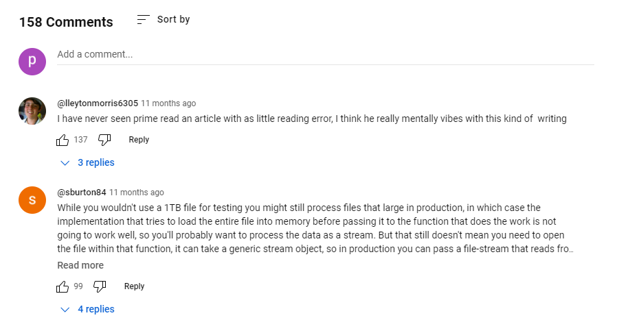
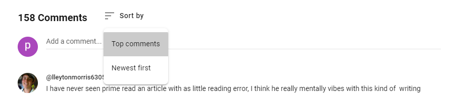
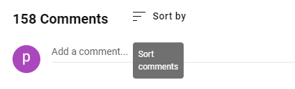
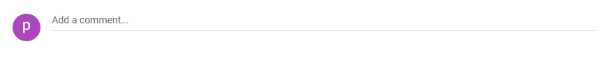
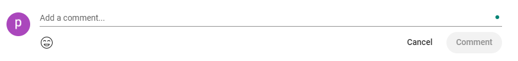
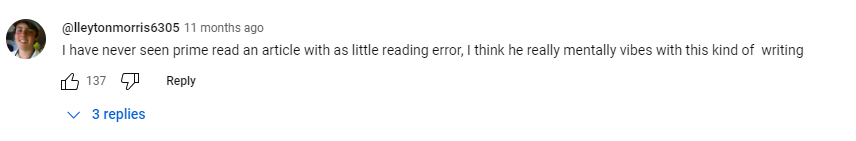

# 仿Youtube评论板

[youtube](https://www.youtube.com/watch?v=isI1c0eGSZ0)


## 评论Title

包括内容

- [ ] 留言数量（当留言数量>0） + "留言"
- [ ] 排序图标+提示文字


点击排序图标

- [ ] 弹出供我们选择的排序规则
  - 最新优先
  - 最热优先
- [ ] 默认排序规则为最热优先
- [ ] 当前应用的规则的背景颜色为`#b7b7b7`
- [ ] 点击之后保持弹出选择框直到再次发生点击事件
- [ ] 点击其中的一个选项，更改当前的排序规则为当前点击的选项
- [ ] 可以使用使用`tab`键来选择排序规则
- [ ] 点击的时候，图标和旁边的排序文字背景有从左到右的颜色渐变动画。



hover评论图标

- [ ] 图标下方出现一段文字
  - [ ] 内容为“排序评论”
  - [ ] 颜色为white
  - [ ] 背景颜色为`#707070`
  - [ ] 宽度为两个字大小
  - [ ] 圆角



## 评论表单

包括内容

- [ ] 用户头像
- [ ] 输入框，占位字符串为“添加一个评论”



聚焦到输入框（鼠标点击或`tab`）

- [ ] 动画效果，输入框从中间向两侧延申出黑色的线，保持最终的效果直到取消聚焦。
- [ ] 出现取消和评论按钮
  - [ ] 当输入框中没有文字的时候，评论按钮为`disabled`
  - [ ] 这里我们需要三种类型的按钮:
    - default
      - 背景色为`balck`
      - 透明度为0
      - 字体颜色`black`
      - 圆角
    - hover
      - 透明度0.1
    - disabled
      - 透明度0.05
      - 字体颜色`#909090`



- [ ] 取消聚焦，按钮不消失，点击取消才消失

## 评论Item

包括

- [ ] 头像
  - [ ] 圆形
  - [ ] cursor pointer
  - [ ] 点击跳转到该用户首页
- [ ] 用户名
  - [ ] cursor pointer
  - [ ] 点击跳转到该用户首页
- [ ] 评论发布时间(服务端返回，不需要前端计算)
  - [ ] 格式要求
    - [ ] xx 秒之前 < 60 seconds
    - [ ] xx 分钟之前 < 60 minutes
    - [ ] xx 小时之前 < 24 hours
    - [ ] xx 天之前 < 30 days
    - [ ] xx 月之前 < 12 months
    - [ ] xx 年之前
  - [ ] cursor pointer
  - [ ] 点击跳转到当前页面
- [ ] 评论内容
  - [ ] 最大宽度限制
- [ ] 点赞
  - [ ] 图标 + 点赞个数（当个数不为0的时候显示）
  - [ ] 这里的图标其实是一个button
    - [ ] hover
      - [ ] 透明度 0.1
      - [ ] 提示“喜欢”或者“不喜欢”(和hover评论图标时出现的提示样式一样)
    - [ ] 点击
      - 图标fill变为黑色
      - 数量 + 1
      - 再次点击之后取消点赞
- [ ] 恢复按钮
- [ ] 折叠展开评论按钮
  - [ ] 内容
    - [ ] 箭头
      - [ ] 折叠的时候箭头向下
      - [ ] 收起的时候箭头向上
    - [ ] 评论数量 + “回复”
  - [ ] 样式
    - [ ] 字体颜色`#065fdc`
    - [ ] 背景色和字体颜色一样
    - [ ] 透明度为0
    - [ ] hover
      - [ ] 透明度为0.1
- [ ] 嵌套评论
  - 其实并不是嵌套，只是在评论前面加上了`@<username>`，这里的`username`是你评论的评论作者。(如果没有这个username，那么你的评论是评论哪一条评论的呢?)


服务端的数据格式

- 一条评论信息

```
{
  commentId,
  userName,
  avatar,
  homeUrl,
  comment,
  likes,
  unlikes,
  replies,
}
```

注：

- `replies`是一个数组
  * 元素和上面的一致?
  * 或者是一些`commentId`，然后等我们展开回复的时候再去请求？
    * 这个方案更好一些，如果评论比较多，我们在一开始会请求大量的评论数据，而这些评论我们不是每个都看到，或者说只看其中的一小部分。
- 这里的`userName`是唯一的，可以用来区分其他用户
- 这里的`commentId`是唯一的，可以用来区分其它评论
- 我们需不需要一个用户schema?
```
{
  userName,
  avatar,
  homeUrl,
}
```
那么上面的comment schema
```
{
  commentId,
  userName, // -> avatar, homeUrl
  comment,
  likes,
  unlikes,
  replies,
}
```
问题:

1. 如何获取某一视频下的所有评论?

`get /comments?id=xxxxx`, 这里的`id=xxxx`可以区分不同的视频。

2. 如何区分评论（这样我们就可以修改特定的评论了）？

`commentId`

3. 如何给特定评论的点赞?

- 点赞
  - `post /comment/:commentId/likes`
  - body(`json`)
    - `userName` (谁点的赞)
- 取消点赞
  - 服务端得保存点赞记录，只有当前处于点赞状态的才可以取消
- 服务端逻辑
  - 点赞和取消点赞请求是一样的
  - 如果检查发现该用户已经给该条评论点赞，就取消点赞，否则就点赞。
- 客户端如何更新?
  - 乐观更新?
  - 发生错误该如何告知用户?
  - Youtube中采用的策略是?
    - 前端更新和后端是分开的，前端立刻更新页面
    - 点赞失败并不提示(手动刷新之后，你才可以检查到自己点在是否成功)
4. 如何发布一条评论?
  * `post /comments/video`
  * body
    * `userName`(谁发的)
    * `comment`(发了什么)
    * `videoId`(哪个视频下发的)
5. 如何发布一条回复?
  * `post /comments/reply`
  * body
    * `userName`(谁发的)
    * `comment`(发了什么)
    * `commentId`(回复的是哪一条评论)


## 评论列表

- [ ] 由多个评论组成
- [ ] 滚动分页
